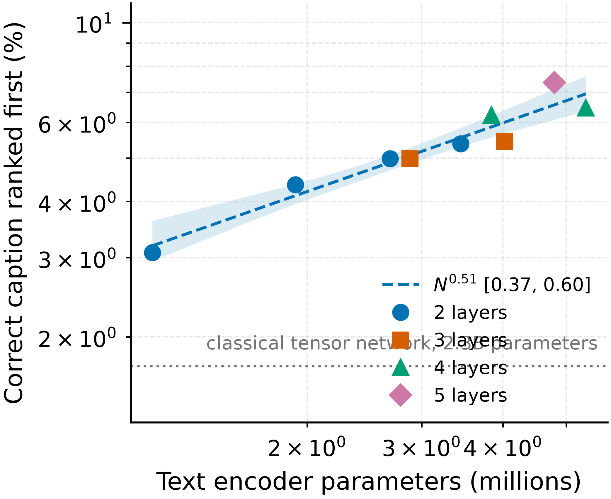
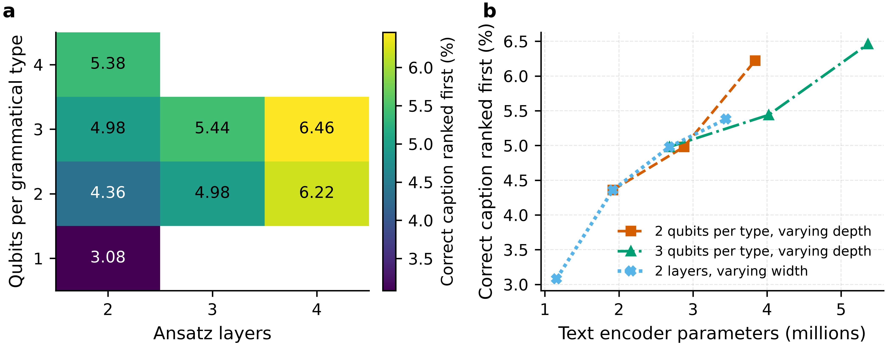
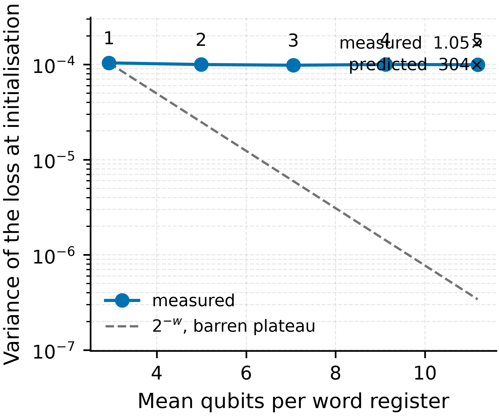
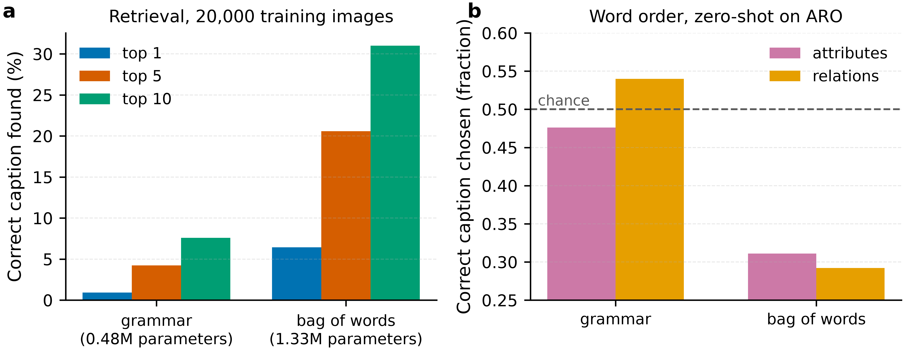

# Quantum text encoders on MSCOCO

This repository contains the code and results for training a compositional
quantum text encoder on the full MSCOCO retrieval benchmark. It extends
[QCLIP](https://github.com/quantum-learning-labs/QCLIP), which was previously
evaluated on SVO-Probes and ARO.

Each caption is parsed to a CCG derivation. Every word is assigned a
parameterised quantum circuit whose number of qubits is set by its grammatical
type. Composition follows the parse, and the resulting state is scored against
a frozen CLIP image embedding. All circuits are simulated classically by tensor
contraction. No quantum hardware is used.

## Results

Image-to-text recall on the 5,000-image `val2017` test split, with 24,909
candidate captions. Chance is 0.02%. Each configuration was trained once.

| configuration | text parameters | epochs | R@1 | R@5 | R@10 |
|---|---|---|---|---|---|
| 2 qubits/type, 5 layers | 4,797,556 | 100 | 7.36 | 22.84 | 33.84 |
| 3 qubits/type, 4 layers | 5,363,041 | 100 | 6.46 | 21.54 | 33.26 |
| 2 qubits/type, 4 layers | 3,838,045 | 100 | 6.22 | 21.62 | 32.88 |
| 4 qubits/type, 2 layers | 3,444,019 | 100 | 5.38 | 17.54 | 26.90 |
| 2 qubits/type, 3 layers | 2,878,534 | 100 | 4.98 | 19.48 | 30.26 |
| 1 qubit/type, 2 layers | 1,156,525 | 100 | 3.08 | 12.46 | 20.10 |
| classical tensor network | 2,310,327,176 | 30 | 1.72 | 6.30 | 9.84 |

The classical baseline was trained for 30 epochs rather than 100. Its
validation R@1 over the final four epochs was 0.065, 0.067, 0.068 and 0.065,
while its training loss continued to fall from 2.450 to 2.319.

Complete tables are in [`report/summary.md`](report/summary.md). Every
benchmark run, including intermediate checkpoints, is in
[`report/test_results.csv`](report/test_results.csv).

## Scaling with model size

Nine configurations were trained on the full training set, varying qubits per
grammatical type (n) from 1 to 4 and ansatz layers (L) from 2 to 5. Power laws
were fitted in text-encoder parameter count, with 95% intervals from a
bootstrap over the fitted points.

| series | varied | exponent | 95% interval |
|---|---|---|---|
| L = 2 | n = 1 to 4 | 0.51 | 0.31 to 0.69 |
| n = 2 | L = 2 to 5 | 0.58 | 0.33 to 0.77 |
| n = 3 | L = 2 to 4 | 0.37 | 0.22 to 0.60 |

Depth and width give different returns per parameter, so no single exponent in
parameter count describes all nine runs. The configuration at n = 2, L = 5
scores higher than n = 3, L = 4 while using 10% fewer parameters. The intervals
overlap, and the parameter range spans 0.67 decades, so these are comparisons
between measured configurations rather than a fitted scaling law.

<p align="center">
  
  
</p>

Figure 1, left: accuracy against text-encoder parameters. The fitted line and
interval cover the L = 2 width series only. Right: the same nine runs as a
grid, and plotted against parameter count.

## Loss concentration at initialisation

The text tower was reinitialised 10,000 times without training, and the
variance of the loss was measured at each setting of n. The mean number of
qubits per word register rises from 2.9 at n = 1 to 11.2 at n = 5. Over that
range the measured variance changes by a factor of 1.05. Concentration of the
form 2^-w predicts a factor of 304.

The relevant width is the per-word register rather than the total qubit count
of a caption, because the resampled parameters belong to individual word
circuits.

## Effect of removing the grammar

The parse was replaced with a commutative product over word states, which makes
word order invisible to the encoder. Both models were trained on 20,000 images.

| model | text parameters | R@1 | R@5 | R@10 |
|---|---|---|---|---|
| grammar | 479,353 | 0.92 | 4.22 | 7.60 |
| commutative product | 1,329,967 | 6.44 | 20.58 | 31.00 |

The commutative model uses 2.8 times more parameters, because every word
receives a full nine-qubit register regardless of its grammatical type.

The two models were then evaluated zero-shot on ARO. At 3,650 pairs the
standard error is 0.0083 and chance is 0.500.

| model | attributes | relations |
|---|---|---|
| grammar | 0.476 (2.9 SE below chance) | 0.540 (4.9 SE above) |
| commutative product | 0.311 (22.8 SE below) | 0.292 (25.2 SE below) |

The commutative model selects the corrupted caption more often than the correct
one on both ARO subsets.

<p align="center">
  
  
</p>

Figure 2, left: variance of the loss at initialisation against per-word
register width, with the 2^-w prediction. Right: retrieval and ARO for the two
models at 20,000 training images.

## Other ablations

Fourteen modifications were tested at 10,000 training images: temperature,
batch size, the number of ansatz layers, the image projection, freezing the
image encoder, vocabulary sharing by lemma, symbol dropout, a learned angle
generator, and removal of each of the three loss terms that depart from the
published objective. None scored above the unmodified configuration. Removing
the purity penalty produced the largest drop of the three loss terms.

## Implementation

The upstream executor passes every gate to `opt_einsum` separately, giving
about 284 operands per caption. Two replacements were written, each verified
against the previous one.

`src/executors/compact_exec.py` contracts each word's gates into a single
tensor before the sentence network. Operands per caption fall to about 10 and
epoch time on the full training set from 185 minutes to 13.

`src/executors/ring_sentence.py` represents a word as tensor-ring cores of bond
dimension 2^L rather than a 2^N statevector. A ring of CNOTs is a running XOR
over GF(2), so the representation is exact and involves no truncation. At 21
wires this is 672 complex numbers rather than 2,097,152.

Across the two rewrites, forward values agree to 1e-7, gradients to 1e-5, and
training losses to four decimal places over 47 matched epochs. The comparisons
are in [`scripts/verify/`](scripts/verify).

## Fixes to the upstream code

Seven fixes were applied, four of which prevented training from working:

1. The contrastive loss did not normalise its embeddings, so image magnitude
   acted as a per-sample temperature.
2. The optimiser iterated over a million separate tensors per step.
3. Contraction paths were searched with the batch axis attached.
4. The benchmark registered test vocabulary before loading weights, so it
   evaluated a randomly initialised model.

All are collected in
[`scripts/patches/apply_fixes.py`](scripts/patches/apply_fixes.py), which is
idempotent and reports which fixes were already present.

## Installation

This repository is an overlay on a QCLIP checkout rather than a standalone
package. It imports `modules.*` from QCLIP in 25 files and patches four QCLIP
source files in place.

```bash
git clone https://github.com/quantum-learning-labs/QCLIP.git qulip
cd qulip
git clone https://github.com/MehulBandhu/qulip-mscoco.git overlay
cp -r overlay/src overlay/scripts overlay/configs .
python -m pip install -r overlay/requirements.txt
python scripts/patches/apply_fixes.py
```

All commands below are run from the QCLIP root.

## Reproducing

To rebuild the tables and figures from the compiled results:

```bash
python scripts/report/compile_results.py   # logs and results -> report/*.csv
python scripts/report/figures.py           # csv -> report/figures/*.pdf
```

To train and benchmark a configuration:

```bash
sbatch scripts/jobs/train.sh vqcfull_n2l5
sbatch scripts/jobs/bench.sh vqcfull_n2l5
```

## Layout

```
src/executors/     the circuit executors
src/training/      multi-positive dataset and loss
scripts/patches/   fixes and features applied to the QCLIP fork
scripts/analysis/  diagnostics that do not train anything
scripts/verify/    equivalence checks between executors
scripts/report/    result harvesting and figures
scripts/jobs/      Slurm submission scripts
configs/           one YAML per experiment
report/            compiled tables and figures
```

## Limitations

Each configuration was trained once. No seeds were repeated, so the retrieval
numbers carry no error bars, and differences below roughly 0.3 in R@1 fall
within the variance to be expected between seeds.

The classical baseline was trained for 30 epochs against the quantum models'
100, as noted above.

Checkpoints were selected on a 1,000-image subset of the test set. The reported
numbers use the final checkpoint, which does not depend on that selection.
Configurations were compared on the full test set during development, so the
choice of which configurations to report is not independent of the test set.

Published MSCOCO retrieval results use the Karpathy split; these use `val2017`.
Zero-shot CLIP scores 48.4 R@1 on this split against a published 50.0.

The classical baseline's parameter count varies with the size of the training
set, because it allocates tensors per vocabulary item: 480M at 5,000 images,
660M at 10,000, 940M at 20,000 and 2.31B on the full set.

## References

The model and codebase this extends:

```
@inproceedings{limbackstokin2026meaning,
  title={Meaning Representations as Variational Quantum Circuits},
  author={Limb\"{a}ck-Stokin, Tilen G. and Birdavade, Tanishka A.
          and Lo, Kin Ian and Sadrzadeh, Mehrnoosh},
  booktitle={LREC},
  year={2026}
}
```

The classical tensor-network encoder used as a baseline is DisCoCLIP,
[Lo et al. (2025)](https://arxiv.org/abs/2509.21287).
